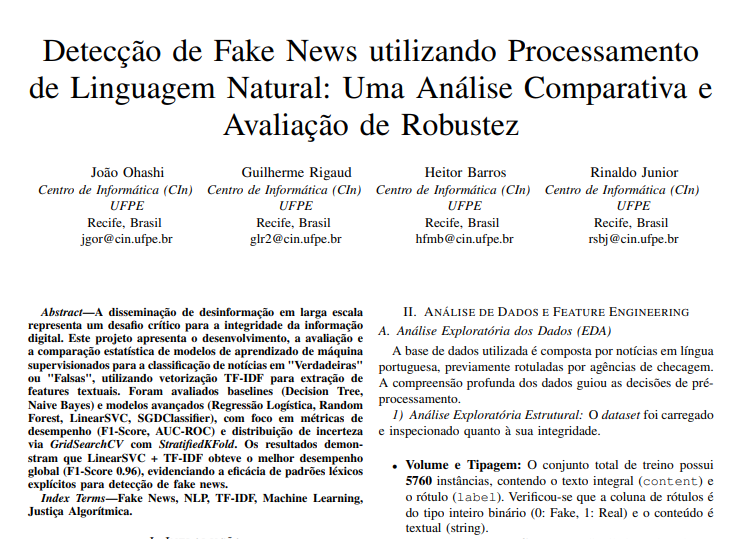

# Detecção de Fake News em Português



## Sobre o Projeto

Este projeto foi desenvolvido como parte da disciplina CIN0144 - Aprendizado de Máquina e Ciência de Dados, com o objetivo de criar um sistema automatizado para detecção de notícias falsas em português.

## Descrição

O projeto implementa uma pipeline completa de Machine Learning para classificação binária de notícias, distinguindo entre notícias verdadeiras e falsas. A abordagem combina técnicas tradicionais de processamento de linguagem natural (NLP) com algoritmos de aprendizado supervisionado, demonstrando que métodos clássicos podem alcançar excelente desempenho nesta tarefa.

### Principais Características

- **Dataset**: Conjunto de dados de notícias em português balanceado entre classes fake/real
- **Pré-processamento Robusto**: 
  - Remoção de duplicatas
  - Conversão para lowercase
  - Limpeza de caracteres especiais e pontuação
  - Remoção de stopwords em português
  - Normalização de espaços
- **Extração de Features**: 
  - **TF-IDF** (Term Frequency-Inverse Document Frequency) para vetorização de texto
  - Captura eficiente da importância de palavras no corpus
  - Combinação de unigramas e bigramas
- **Otimização de Hiperparâmetros**:
  - GridSearchCV para tunagem automática
  - Validação cruzada estratificada (StratifiedKFold)
  - Otimização baseada em F1-Score
- **Modelos Avaliados**:
  - **LinearSVC** (melhor desempenho: F1-Score 96.04%)
  - **Logistic Regression** (F1-Score 95.62%)
  - Random Forest
  - SGD Classifier
  - Decision Tree
  - Multinomial Naive Bayes

### Resultados

O modelo **LinearSVC com TF-IDF** alcançou excelentes resultados no conjunto de teste:
- **Acurácia**: 96.04%
- **F1-Score**: 96.04%
- **Precisão**: 96.04%
- **Recall**: 96.04%
- **AUC-ROC**: 99.20%

### Análise Estatística

Foi realizado o **Teste de McNemar** para comparação estatística entre os dois melhores modelos (LinearSVC e Logistic Regression), validando que não há diferença estatisticamente significativa entre eles (p-value = 0.3074), confirmando a robustez da abordagem com TF-IDF.

### Insights

- **Eficiência do TF-IDF**: Demonstrou-se que features clássicas de TF-IDF são altamente eficazes para detecção de fake news em português
- **Padrões Lexicais**: A alta performance sugere que fake news apresentam padrões lexicais e de frequência de termos distintos
- **Simplicidade e Performance**: Abordagem simples e eficiente computacionalmente, sem necessidade de modelos de linguagem complexos

## Estrutura do Projeto

```
fake-news-detection/
├── Detecção_de_Fake_News_Projeto_CIN0144.ipynb  # Notebook principal com análise completa
 Relatórios de métricas e resultados
├── assets/                                        # Imagens e recursos visuais
└── README.md                                      # Documentação do projeto
```

## Tecnologias Utilizadas

- **Python 3.11**
- **scikit-learn** - Modelos de ML e métricas
- **NLTK** - Processamento de linguagem natural e stopwords
- **Pandas & NumPy** - Manipulação e análise de dados
- **Matplotlib & Seaborn** - Visualização de dados
- **Statsmodels** - Testes estatísticos (McNemar)
- **Google Colab** - Ambiente de desenvolvimento