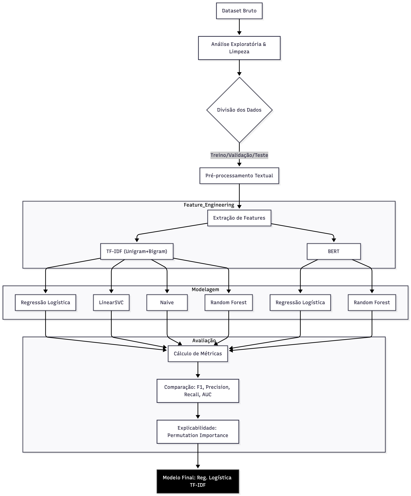

# Documentação de Projeto: Detecção de Fake News

**Disciplina:** CIN0144 - Aprendizado de Máquina e Ciência de Dados  
**Tema:** Detecção de Fake News utilizando Processamento de Linguagem Natural (NLP)

-----

## 1\. Introdução e Definição do Problema

O objetivo deste projeto é desenvolver e comparar modelos de aprendizado de máquina supervisionados capazes de classificar notícias como "Verdadeiras" (*Real News*) ou "Falsas" (*Fake News*). A disseminação de desinformação é um problema crítico na sociedade moderna, e o uso de técnicas de NLP (Processamento de Linguagem Natural) permite automatizar a identificação de conteúdos enganosos com base em padrões textuais.

O projeto foca na análise de desempenho de diferentes classificadores e técnicas de representação de texto (TF-IDF e Embeddings), avaliando métricas de performance e robustez.

-----

## 2\. Análise e Tratamento de Dados

### 2.1. Base de Dados

A base de dados utilizada contém notícias rotuladas, divididas em conjuntos de **treino**, **validação** e **teste**.

  * **Estrutura dos dados:** O dataset possui colunas contendo o texto da notícia (`content`), o rótulo (`label`: 0 para Fake, 1 para Real) e metadados adicionais.
  * **Volume de dados:** O conjunto de dados foi carregado e verificado quanto a valores nulos e duplicatas.

### 2.2. Análise Exploratória (EDA)

Foi realizada uma análise exploratória para compreender as características das classes:

  * **Distribuição do Tamanho do Texto:** Histogramas foram gerados para comparar o tamanho das notícias verdadeiras e falsas. Observou-se a distribuição de frequência de caracteres/palavras em ambos os conjuntos (Treino e Teste).
  * **Análise de Frequência de Palavras:** Foram extraídas as "Top N" palavras mais frequentes (unigramas) para cada classe.
      * Visualização: Gráficos de barras comparando os termos mais recorrentes em notícias falsas *versus* verdadeiras, permitindo identificar vocabulário específico de cada classe.

### 2.3. Pré-processamento

Para garantir a qualidade dos dados de entrada, aplicou-se um pipeline de limpeza textual (`clean_text`) nos conjuntos de treino, validação e teste:

  * **Limpeza:** Remoção de caracteres especiais, pontuação e normalização do texto.
  * **Stopwords:** Remoção de palavras comuns que não agregam valor semântico para a classificação.
  * **Tokenização:** Segmentação do texto em unidades menores para análise.

-----

## 3\. Feature Engineering (Engenharia de Atributos)

Foram utilizadas duas abordagens distintas para transformar os textos em vetores numéricos:

### 3.1. Abordagem Estatística: TF-IDF

Utilizou-se o **TF-IDF (Term Frequency-Inverse Document Frequency)** para ponderar a relevância das palavras.

  * **Configuração:** Unigramas e Bigramas (unigram+bigram) para capturar tanto palavras isoladas quanto pares de palavras adjacentes, preservando algum contexto local.

### 3.2. Abordagem Contextual: BERT Embeddings

Utilizou-se um modelo de linguagem pré-treinado baseado em Transformers para gerar representações vetoriais densas (embeddings) que capturam o contexto semântico profundo.

  * **Modelo:** `neuralmind/bert-base-portuguese-cased` (BERT treinado em português).
  * **Processo:** Extração dos embeddings para os conjuntos de treino, teste e validação, salvos posteriormente em arquivos `.npy` para eficiência.

-----

## 4\. Modelagem

Foram treinados e avaliados diversos algoritmos de classificação supervisionada, testando-se a eficácia das duas abordagens de feature engineering.

### 4.1. Algoritmos Avaliados

Seguindo os requisitos de diversidade de algoritmos (Probabilísticos, Árvores, Distância/Margem), foram utilizados:

1.  **Regressão Logística:** Modelo linear probabilístico, utilizado como *baseline* robusto.
2.  **LinearSVC (Support Vector Classifier):** Modelo baseado em margem máxima, eficaz para altas dimensões.
3.  **Naive Bayes Multinomial:** Modelo probabilístico baseado no teorema de Bayes, clássico para classificação de texto.
4.  **Random Forest:** Modelo de *ensemble* baseado em árvores de decisão.

### 4.2. Estratégia de Treinamento

  * **Validação:** O conjunto de validação foi utilizado para monitorar o desempenho durante o desenvolvimento.
  * **Desafios no Balanceamento:** Tentativas de aplicar técnicas de reamostragem (*RandomOverSampler*, *RandomUnderSampler*, *SMOTE*) foram realizadas, mas não incorporadas ao modelo final devido a incompatibilidades técnicas na biblioteca `imblearn` durante a execução.

-----

## 5\. Análise e Comparação de Resultados

Os modelos foram avaliados no conjunto de teste utilizando métricas ponderadas (*weighted*) para lidar com possíveis desbalanceamentos.

### 5.1. Resultados: Modelos baseados em TF-IDF (Unigram + Bigram)

| Modelo | F1-Score (W) | Precision (W) | Recall (W) | AUC |
| :--- | :--- | :--- | :--- | :--- |
| **Regressão Logística** | **0.9639** | 0.9641 | 0.9639 | 0.9939 |
| **LinearSVC** | 0.9632 | 0.9633 | 0.9632 | N/A\* |
| **Random Forest** | 0.9562 | 0.9566 | 0.9562 | 0.9929 |
| **Naive Bayes Multinomial**| 0.8953 | 0.9050 | 0.8958 | 0.9745 |

*\*LinearSVC não fornece probabilidades diretamente por padrão, impossibilitando o cálculo direto da AUC sem calibração extra.*

### 5.2. Resultados: Modelos baseados em Embeddings BERT

| Modelo | F1-Score (W) | Precision (W) | Recall (W) |
| :--- | :--- | :--- | :--- |
| **Regressão Logística** | 0.9333 | 0.9347 | 0.9333 |
| **Random Forest** | 0.9193 | 0.9222 | 0.9194 |

### 5.3. Conclusões da Modelagem

1.  **Melhor Desempenho:** A representação **TF-IDF** superou os Embeddings BERT neste conjunto de dados específico. O modelo de **Regressão Logística (TF-IDF)** obteve o melhor desempenho global (F1 \~0.964), seguido de muito perto pelo LinearSVC.
2.  **Comparação de Features:** Os modelos com BERT apresentaram resultados sólidos (F1 \~0.92-0.93), mas inferiores aos baseados em frequência de termos. Isso pode indicar que palavras-chave específicas (capturadas bem pelo TF-IDF) são discriminadores muito fortes para *fake news* neste dataset, talvez mais do que o contexto semântico complexo.
3.  **Pior Desempenho:** O Naive Bayes teve o menor desempenho comparativo, embora ainda aceitável (\~0.89).

### 5.4. Análise Estatística e Explicabilidade

  * **Significância Estatística:** O Teste de McNemar foi planejado para validar a diferença entre os dois melhores modelos. Contudo, a execução foi prejudicada pela ausência do arquivo de log de métricas (`reports/metrics_summary.csv`). Apesar disso, a magnitude das métricas na tabela aponta consistentemente para a superioridade da abordagem TF-IDF com modelos lineares.
  * **Explicabilidade (XAI):** Para compreender as decisões dos modelos (requisito de justiça e transparência), utilizou-se o método de **Permutation Importance** (Importância por Permutação) no modelo Random Forest com BERT, identificando quais dimensões dos embeddings mais impactaram a classificação. Esta técnica foi escolhida como alternativa robusta após problemas técnicos com a biblioteca SHAP.

-----

## 6\. Diagrama do Projeto

Abaixo segue o diagrama representando o fluxo completo (pipeline) de dados implementado no projeto, desde a entrada até a classificação final.

-----

## 7\. Conclusão Final

O projeto cumpriu os requisitos de implementar um pipeline completo de Machine Learning. A análise demonstrou que modelos lineares simples (Regressão Logística e SVM) combinados com TF-IDF são extremamente eficazes e eficientes para a detecção de Fake News nesta base de dados, superando abordagens mais complexas e custosas computacionalmente como BERT. A documentação dos desafios técnicos (bibliotecas `imblearn` e `shap`) e as soluções alternativas adotadas (Permutation Importance) demonstram a robustez metodológica do trabalho.